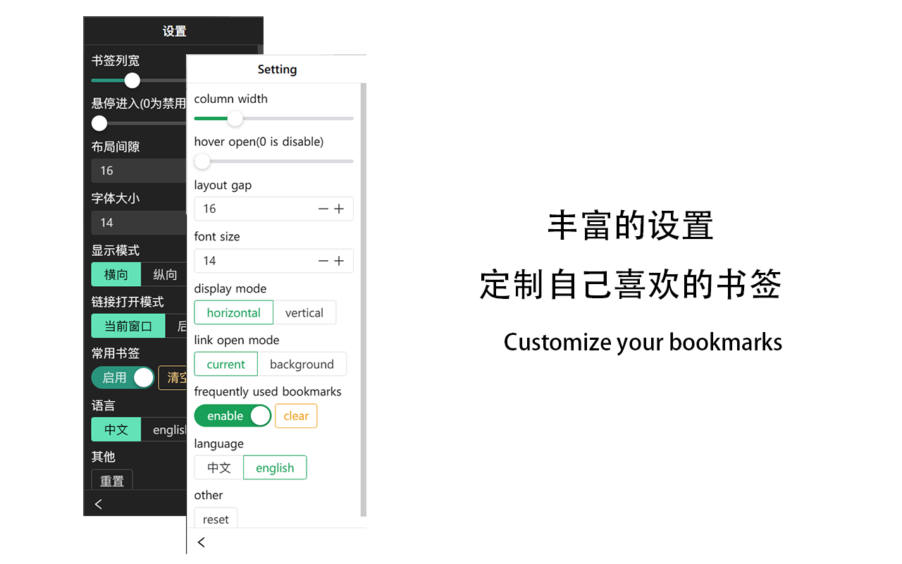
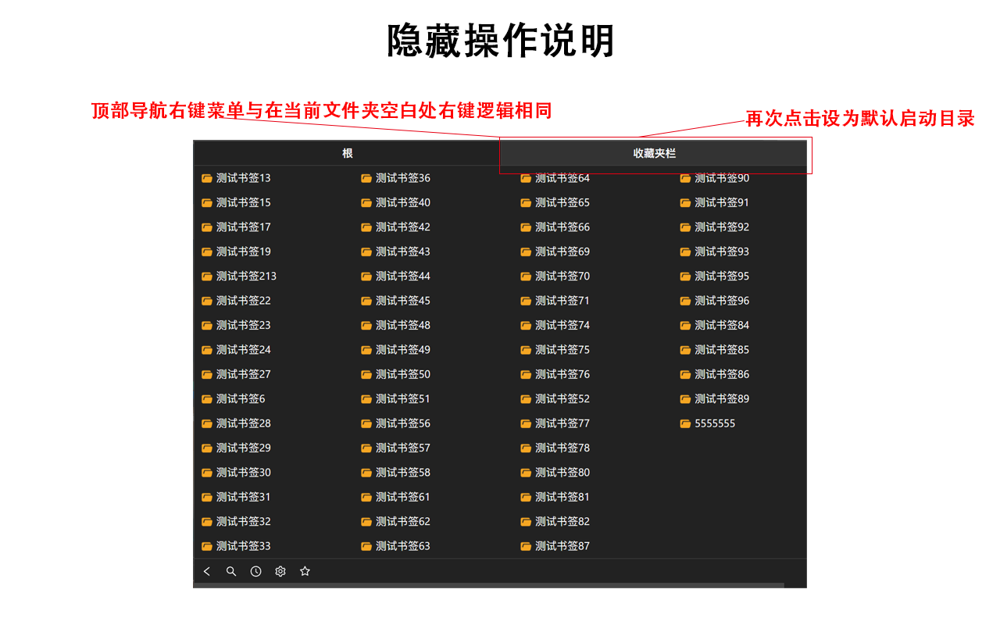

## 概述
该扩展旨在于让浏览器(edge/chrome)可以显示更多的书签。

## 截图

## 功能描述：
* 点击顶部当前导航可以设置默认启动目录。
* 常用书签功能，记录你点击频率最高的书签（本地记录，不涉及隐私，如不需要可设置中关闭）。
* 可自行调节书签列宽、悬停进入、布局间隙，字体大小，定制出最适合你的书签。
* 可选横向显示、纵向显示书签，满足自己的喜好。
* 可选链接打开模式，一次性打开你所需要的所有书签，不必重复进入插件。
* 支持拖拽排序
* 多语言支持
* 自定义字体
* 右键菜单（前/后台打开链接、复制链接/名称、 剪切/粘贴/编辑/删除、打开全部（文件夹）、新建文件夹/书签（自动填充为当前页面））
* 等...

## 链接
现已开源：https://github.com/X-X-X-X-X-X-X-X-X-X-X-X-X/Bookmark.git ，欢迎star与提issue

EDGE商店链接：https://microsoftedge.microsoft.com/addons/detail/gedhecaldmggohkefcllkmpnhojmabap
（EDGE扩展审核真的太慢太慢太慢太慢太慢了）

## 打赏

用爱发电，打赏支持一下？

