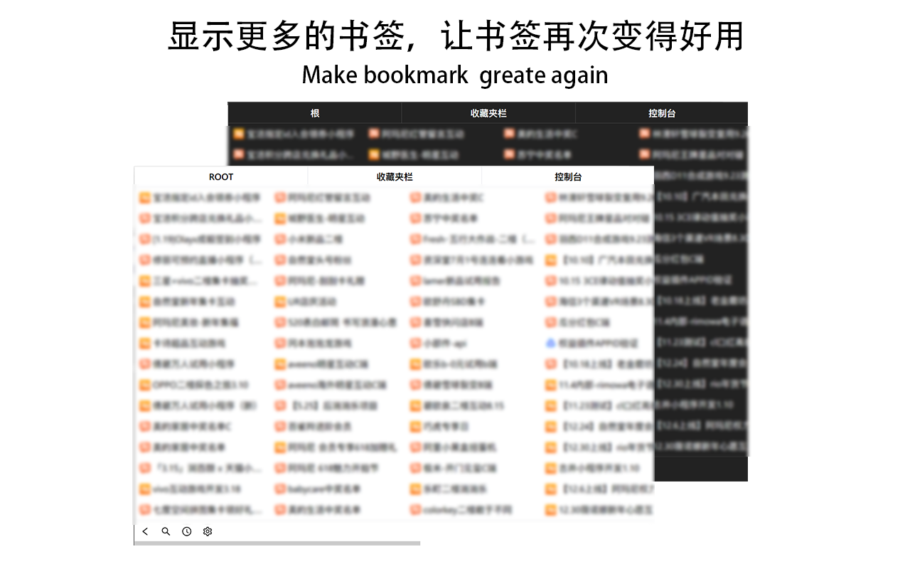
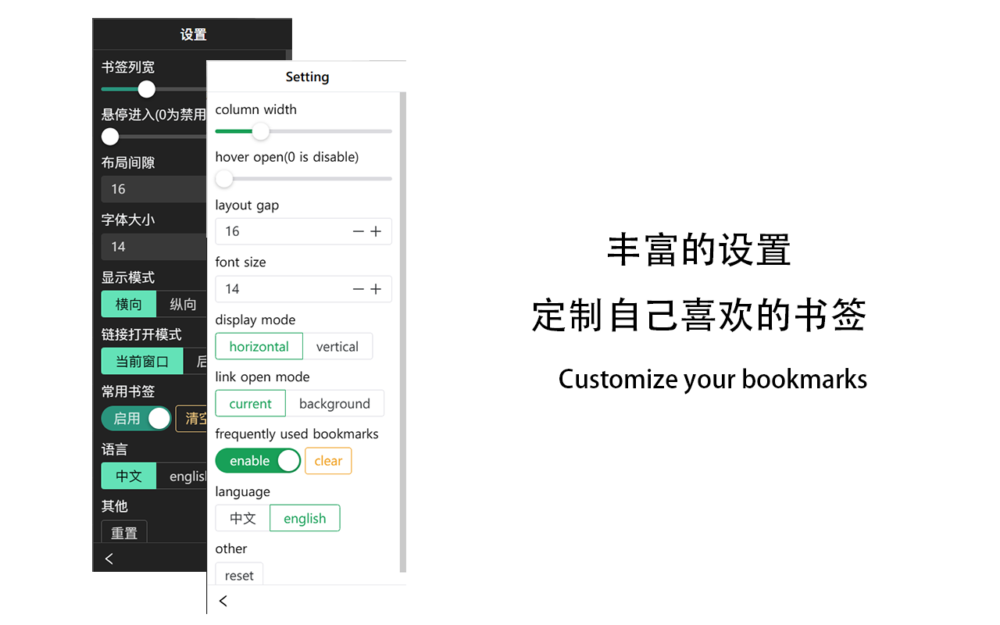
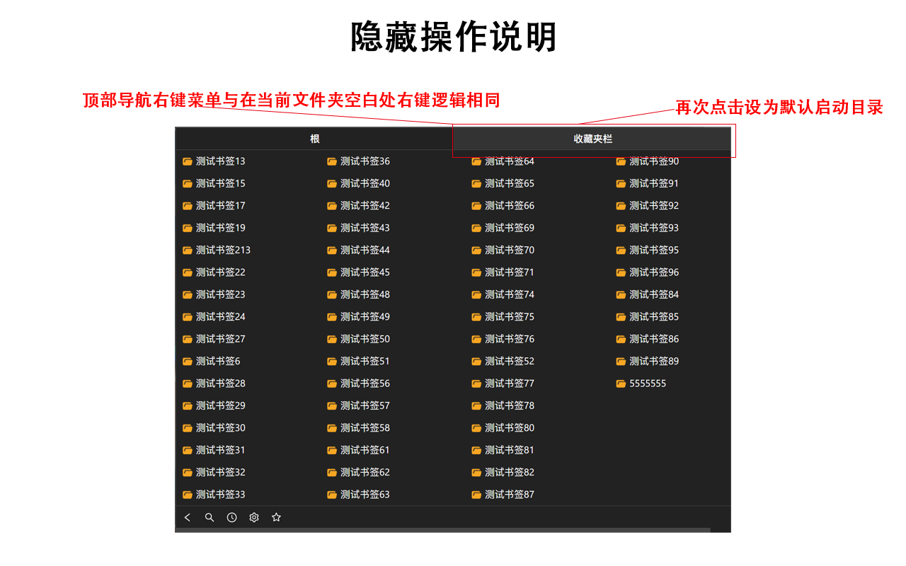

## 概述

模拟书签栏，让浏览器(edge/chrome)可以显示更多的书签。

## 截图

<div style="display:flex; gap: 8px; overflow: auto;">



</div>


## 链接

[Edge Extension](https://microsoftedge.microsoft.com/addons/detail/gedhecaldmggohkefcllkmpnhojmabap)

[Chrome Extension](https://chromewebstore.google.com/detail/bookmark-%E7%96%AF%E5%AD%90%E7%9A%84%E5%A4%A9%E7%A9%BA/dkfjimaeopnlhjnbmhckcnhkplbeeiob)

## RUN

```shell
npm install
npm run build
```

## Star History

<a href="https://www.star-history.com/?repos=X-X-X-X-X-X-X-X-X-X-X-X-X%2FBookmark&type=date&legend=top-left">
 <picture>
   <source media="(prefers-color-scheme: dark)" srcset="https://api.star-history.com/chart?repos=X-X-X-X-X-X-X-X-X-X-X-X-X/Bookmark&type=date&theme=dark&legend=top-left" />
   <source media="(prefers-color-scheme: light)" srcset="https://api.star-history.com/chart?repos=X-X-X-X-X-X-X-X-X-X-X-X-X/Bookmark&type=date&legend=top-left" />
   
 </picture>
</a>

## 打赏


